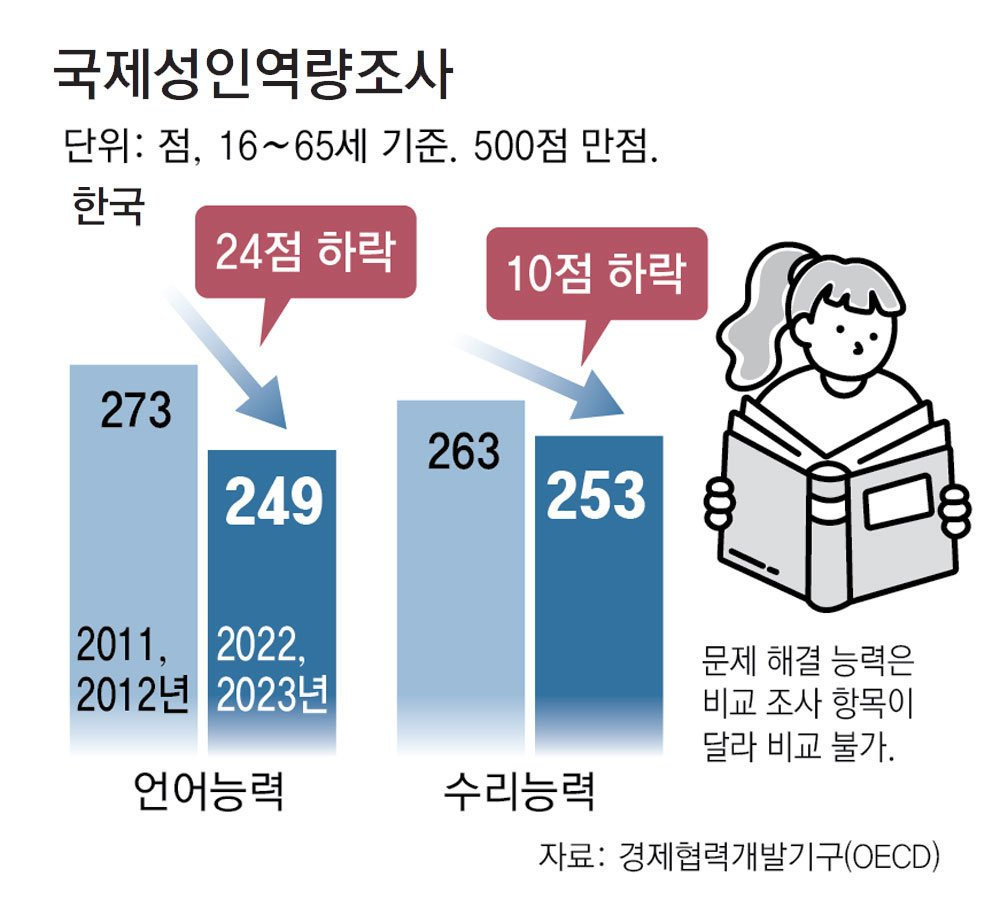
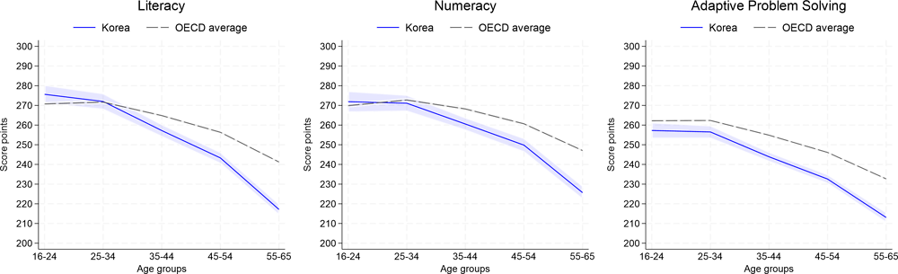
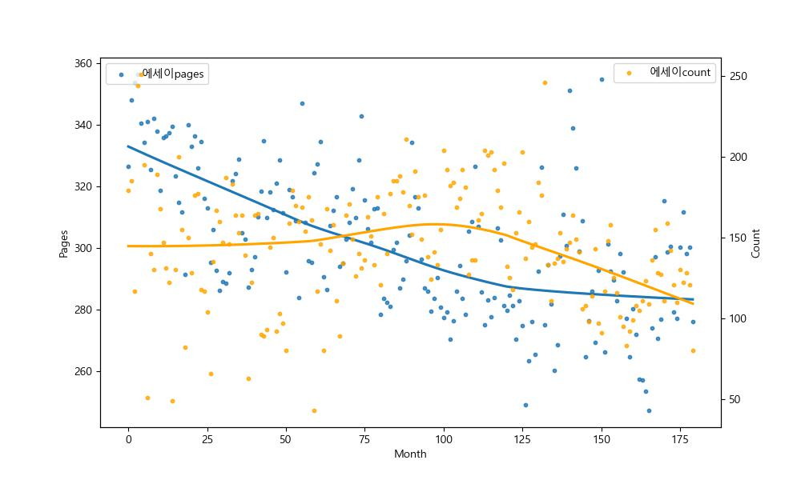
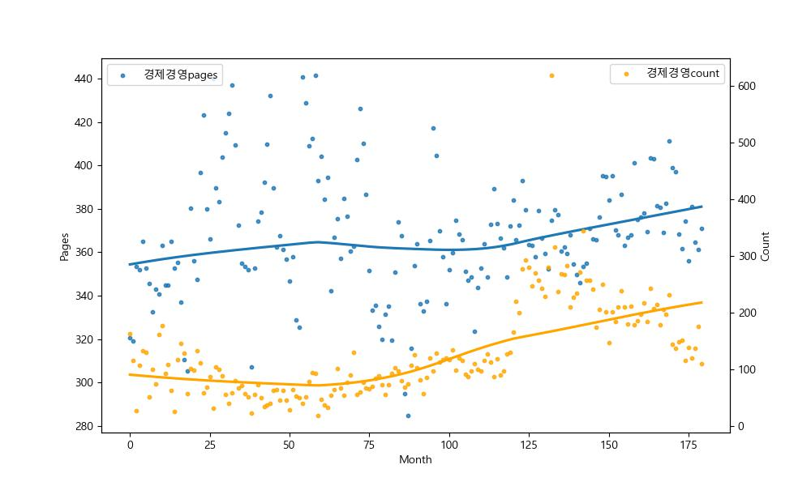

# 1. 목표와 배경




최근 OECD 기준 한국의 문해력(성인) 지표는 꾸준히, 지속적인 하향세를 드러내고 있으며, 상위권, 중-하위권을 가리지 않고 하락세를 보이는 중

이에 본인은, 구매자들의 문해력에 가장 큰 영향을 받는 출판시장에서

주요 상품군의 변화, 페이지수의 변화 등을 통해 해당 사회적 변동이 출판시장 변화와 영향을 주고받는지, 출판시장 데이터는 어떤 식으로 변화하는지 파악

# 2. 데이터, EDA와 전처리리

## 2.1 데이터의 수집집

데이터는 인터넷서점 알라딘의 데이터를 활용.

약 30만건의 주별, 연도별 베스트셀러를 추출.

requests를 통해 html 정보를 긁은 후, 페이지 내의 정보를 BS4를 통해 추출함.

### 크롤러 구성

(html 파일 크롤링 코드)
```python
import requests
import bs4
from bs4 import BeautifulSoup
import pandas as pd
import numpy as np


def scraper(year, page, month = None, week = None):
    if (not week) & (not month):
        BestType = 'YearlyBest'
        cnt = 300

    elif week and month: # when in case weekly
        BestType = 'Bestseller'
        cnt = 1000

    elif month & (not week): # when in case monthly
        BestType = 'MonthlyBest'
        cnd = 1000
        week = 3

    params = {
        'BestType': BestType,
        'BranchType': 1,
        'CID': 0,
        'Year': year,
        'Month': month,
        'Week': week,
        'page': page,
        'cnt': cnt,
        'SortOrder': 1
    }

    base_url = 'https://www.aladin.co.kr/shop/common/wbest.aspx?'

    if BestType == 'YearlyBest':
        url_target = f"{base_url}BestType={params['BestType']}&BranchType={params['BranchType']}&CID={params['CID']}&Year={params['Year']}&Month={params['Month']}&Week={params['Week']}&page={params['page']}&cnt={params['cnt']}&SortOrder={params['SortOrder']}"

    elif BestType == 'Bestseller':
        url_target = f"{base_url}BestType={params['BestType']}&BranchType={params['BranchType']}&CID={params['CID']}&Year={params['Year']}&Month={params['Month']}&Week={params['Week']}&page={params['page']}&cnt={params['cnt']}&SortOrder={params['SortOrder']}"

    elif BestType == 'MonthlyBest':
        url_target = f"{base_url}BestType={params['BestType']}&BranchType={params['BranchType']}&CID={params['CID']}&Year={params['Year']}&Month={params['Month']}&Week={params['Week']}&page={params['page']}&cnt={params['cnt']}&SortOrder={params['SortOrder']}"


    response = requests.get(url_target)

    return response.text
```

예시로 반환된 텍스트
```python
soup = scraper(2005, 3, 3, 2)

print(soup)

"\r\n\r\n<!DOCTYPE html PUBLIC "-//W3C//DTD XHTML 1.0 Transitional//EN" "http://www.w3.org/TR/xhtml1/DTD/xhtml1-transitional.dtd">\r\n \r\n<html xmlns="http://www.w3.org/1999/xhtml" >\r\n  <head>\r\n    <title>주간 베스트  : 알라딘</title>\r\n\r\n\t<meta property="og:type" content="website" />\r\n\t<meta property="og:title" content="베스트셀러 : 알라딘" />\r\n\t<meta property="og:url" content="https://www.aladin.co.kr/shop/common/wbest.aspx?BranchType=1&BestType=Bestseller" />\r\n\t<meta property="og:image" content="https://image.aladin.co.kr/img/logo_big.jpg" />\r\n\r\n\t<meta name="twitter:card" content="summary" />\r\n\t<meta name="twitter:title" content="베스트셀러 : 알라딘" />\r\n\t<meta name="twitter:url" content="https://www.aladin.co.kr/shop/common/wbest.aspx?BranchType=1&BestType=Bestseller" />\r\n\t<meta name="twitter:image" content="https://image.aladin.co.kr/img/logo_big.jpg" />\r\n\r\n\t<link rel="canonical" href="https://www.aladin.co.kr/shop/common/wbest.aspx?BranchType=1&BestType=Bestseller" /"
```

html로 다시 변환된 텍스트트
```python
BeautifulSoup(soup, 'html.parser')

</div>
<div class="cscenter_box">
<h3>고객센터 1544-2514 (발신자 부담)</h3>
<address>
<span>서울시 마포구 백범로 71 숨도빌딩 7층</span>
<span>Fax 02-6926-2600</span>
</address>
<div class="cs_link">
<a href="https://www.aladin.co.kr/cs_center/wcs_ConsultQS.aspx?NoLoginQ=1">1:1 문의</a>
<a href="https://www.aladin.co.kr/cs_center/wcs_faq_list.aspx">FAQ</a>
</div>
<div class="shop_info">
<a href="https://www.aladin.co.kr/usedstore/wgate.aspx">중고매장 위치, 영업시간 안내</a>
</div>
</div>
</div>
</div>
<script type="text/javascript">
    function fn_ftc_check() {
        var url ="http://www.ftc.go.kr/info/bizinfo/communicationViewPopup.jsp?wrkr_no=2018123094";
        window.open(url, "communicationViewPopup", "width=750, height=700;");
    }
</script>
<!--파트너 이지웰인 경우 제외 : 스크립트 오류가 발생함-->
<!--에스크로 결제 가입 체크-->
<script language="javascript">
```


위 받은 정보(response된 text)를 토대로, 베스트셀러 도서들의 제목, 해당 도서 링크, 베스트셀러인 단위기간(연, 월, 주) 추출

```python
week_df = pd.DataFrame()
year_df = pd.DataFrame()

week_df_year = []
week_df_month = []
week_df_week = []
week_df_title = []
week_df_link = []


year_df_year = []
year_df_title = []
year_df_link = []


for year in range(2021, 2025):
    for month in range(1, 13):
        for week in range(1, 6):
            for page in range(1, 8):
                soup = scraper(year, page, month, week)
                soup = BeautifulSoup(soup, 'html.parser')

                try:
                    infos = soup.find_all('a', class_ = 'bo3')
                except:
                    break

                for _ in range(len(infos)):
                    week_df_year.append(year)
                    week_df_month.append(month)
                    week_df_week.append(week)

                    week_df_title.append(infos[_].get_text(strip=True))
                    week_df_link.append(infos[_].get('href'))

                print(f'{year}-{month}-{week}-{page}')
                time.sleep(time_norm(norm))

        for page in range(1, 8):
            soup = scraper(year, page, month, year)
            soup = BeautifulSoup(soup, 'html.parser')

            try:
                infos = soup.find_all('a', class_='bo3')
            except:
                pass

            for _ in range(len(infos)):
                month_df_year.append(year)
                month_df_month.append(month)

                month_df_title.append(infos[_].get_text(strip=True))
                month_df_link.append(infos[_].get('href'))
            print(f'{year}-{month}-{page}')
            time.sleep(time_norm(norm))

    for page in range(1, 8):
        soup = scraper(year, page)
        soup = BeautifulSoup(soup, 'html.parser')

        try:
            infos = soup.find_all('a', class_='bo3')
        except:
            pass

        for _ in range(len(infos)):
            year_df_year.append(year)

            year_df_title.append(infos[_].get_text(strip=True))
            year_df_link.append(infos[_].get('href'))
        print(f'{year}-{page}')
        time.sleep(time_norm(norm))
```

## 추출된 연도별 데이터


|    |    0 | 1                         | 2                                                          |
|---:|-----:|:--------------------------|:-----------------------------------------------------------|
|  0 | 2010 | 정의란 무엇인가           | https://www.aladin.co.kr/shop/wproduct.aspx?ItemId=7092756 |
|  1 | 2010 | 아름다운 마무리           | https://www.aladin.co.kr/shop/wproduct.aspx?ItemId=2811362 |
|  2 | 2010 | 덕혜옹주                  | https://www.aladin.co.kr/shop/wproduct.aspx?ItemId=5912511 |
|  3 | 2010 | 1Q84 3                    | https://www.aladin.co.kr/shop/wproduct.aspx?ItemId=7351249 |
|  4 | 2010 | 그들이 말하지 않는 23가지 | https://www.aladin.co.kr/shop/wproduct.aspx?ItemId=7835332 |


# 추출된 주간 데이터

|    |    0 |   1 |   2 | 3                                    | 4                                                          |
|---:|-----:|----:|----:|:-------------------------------------|:-----------------------------------------------------------|
|  0 | 2010 |   1 |   1 | 1Q84 1                               | https://www.aladin.co.kr/shop/wproduct.aspx?ItemId=4342463 |
|  1 | 2010 |   1 |   1 | 1Q84 2                               | https://www.aladin.co.kr/shop/wproduct.aspx?ItemId=4342497 |
|  2 | 2010 |   1 |   1 | 노무현 대통령과 함께하는 2010년 달력 | https://www.aladin.co.kr/shop/wproduct.aspx?ItemId=5872306 |
|  3 | 2010 |   1 |   1 | 박철범의 하루 공부법                 | https://www.aladin.co.kr/shop/wproduct.aspx?ItemId=5985043 |
|  4 | 2010 |   1 |   1 | 엄마를 부탁해                        | https://www.aladin.co.kr/shop/wproduct.aspx?ItemId=2727875 |


위 데이터들에서 url과 서적 이름을 통해 개별 서적의 정보(tag(테마, 주제) 정보와 페이지 수 정보 크롤링)

```python
def scraper_category(soup):
    soup2 = soup.select('#ulCategory a')
    soup2 = str(soup2)
    soup3 = BeautifulSoup(soup2, 'html.parser')
    temp_list = []
    temp = soup3.find_all('a')
    soup3.find_all('a')
    j = 0
    lists_of_theme = []
    for i in soup3.find_all('a'):
        if len(lists_of_theme) < 6:

            if i.text in ['국내도서']:
                j = 0
                j = 1
            elif i.text != '접기':
                if j in [1, 2]:
                    lists_of_theme.append(i.text)
                    j += 1
                else:
                    j += 1
        else:
            break

    targets_conts = soup.find('div', class_='conts_info_list1')
    for i in targets_conts.find_all('li'):
        try:
            if '쪽' in i.text:
                pages = int(i.text[:-1])
                break
        except:
            pages = 0
    
    return lists_of_theme, pages
```


|    | title                                | address                                                    |   pages |   tag1 |   tag2 |   tag3 |   tag4 |   tag5 |   tag6 |
|---:|:-------------------------------------|:-----------------------------------------------------------|--------:|-------:|-------:|-------:|-------:|-------:|-------:|
|  0 | 1Q84 1                               | https://www.aladin.co.kr/shop/wproduct.aspx?ItemId=4342463 |     nan |    nan |    nan |    nan |    nan |    nan |    nan |
|  1 | 1Q84 2                               | https://www.aladin.co.kr/shop/wproduct.aspx?ItemId=4342497 |     nan |    nan |    nan |    nan |    nan |    nan |    nan |
|  2 | 노무현 대통령과 함께하는 2010년 달력 | https://www.aladin.co.kr/shop/wproduct.aspx?ItemId=5872306 |     nan |    nan |    nan |    nan |    nan |    nan |    nan |
|  3 | 박철범의 하루 공부법                 | https://www.aladin.co.kr/shop/wproduct.aspx?ItemId=5985043 |     nan |    nan |    nan |    nan |    nan |    nan |    nan |
|  4 | 엄마를 부탁해                        | https://www.aladin.co.kr/shop/wproduct.aspx?ItemId=2727875 |     nan |    nan |    nan |    nan |    nan |    nan |    nan |

주간 데이터와 월간 데이터의 title과 url link를 담은 별도의 데이터 프레임을 작성한 후

해당 데이터프레임의 link들을 순회하며 requests된 html 정보를 받아 해당 데이터 내에서 약 5만권 도서의 태그 정보(최대 6, lists_of_theme)와 페이지 수(pages)를 추출하여 반환

|    |   Unnamed: 0 | title                                | address                                                    |   pages | tag1         | tag2                | tag3         | tag4                       | tag5     | tag6                       |
|---:|-------------:|:-------------------------------------|:-----------------------------------------------------------|--------:|:-------------|:--------------------|:-------------|:---------------------------|:---------|:---------------------------|
|  0 |            0 | 1Q84 1                               | https://www.aladin.co.kr/shop/wproduct.aspx?ItemId=4342463 |     656 | 소설/시/희곡 | 일본소설            | 소설/시/희곡 | 세계의 문학                | 추천도서 | 알라딘 독자 선정 올해의 책 |
|  1 |            1 | 1Q84 2                               | https://www.aladin.co.kr/shop/wproduct.aspx?ItemId=4342497 |     597 | 소설/시/희곡 | 일본소설            | 소설/시/희곡 | 세계의 문학                | 추천도서 | 알라딘 독자 선정 올해의 책 |
|  2 |            2 | 노무현 대통령과 함께하는 2010년 달력 | https://www.aladin.co.kr/shop/wproduct.aspx?ItemId=5872306 |       0 | 사회과학     | 한국정치사정/정치사 | 달력/기타    | 2010년 달력/가계부         | nan      | nan                        |
|  3 |            3 | 박철범의 하루 공부법                 | https://www.aladin.co.kr/shop/wproduct.aspx?ItemId=5985043 |     260 | 청소년       | 학습법              | 청소년       | 고등교육과정               | nan      | nan                        |
|  4 |            4 | 엄마를 부탁해                        | https://www.aladin.co.kr/shop/wproduct.aspx?ItemId=2727875 |     320 | 소설/시/희곡 | 한국소설            | 추천도서     | 알라딘 독자 선정 올해의 책 | 추천도서 | 알라딘 독자 선정 올해의 책 |


## 2.2 데이터의 처리

|    | title                                | address                                                    |   pages | tag1         | tag2                | tag3         | tag4                       | tag5     | tag6                       |
|---:|:-------------------------------------|:-----------------------------------------------------------|--------:|:-------------|:--------------------|:-------------|:---------------------------|:---------|:---------------------------|
|  0 | 1Q84 1                               | https://www.aladin.co.kr/shop/wproduct.aspx?ItemId=4342463 |     656 | 소설/시/희곡 | 일본소설            | 소설/시/희곡 | 세계의 문학                | 추천도서 | 알라딘 독자 선정 올해의 책 |
|  1 | 1Q84 2                               | https://www.aladin.co.kr/shop/wproduct.aspx?ItemId=4342497 |     597 | 소설/시/희곡 | 일본소설            | 소설/시/희곡 | 세계의 문학                | 추천도서 | 알라딘 독자 선정 올해의 책 |
|  2 | 노무현 대통령과 함께하는 2010년 달력 | https://www.aladin.co.kr/shop/wproduct.aspx?ItemId=5872306 |       0 | 사회과학     | 한국정치사정/정치사 | 달력/기타    | 2010년 달력/가계부         | nan      | nan                        |
|  3 | 박철범의 하루 공부법                 | https://www.aladin.co.kr/shop/wproduct.aspx?ItemId=5985043 |     260 | 청소년       | 학습법              | 청소년       | 고등교육과정               | nan      | nan                        |
|  4 | 엄마를 부탁해                        | https://www.aladin.co.kr/shop/wproduct.aspx?ItemId=2727875 |     320 | 소설/시/희곡 | 한국소설            | 추천도서     | 알라딘 독자 선정 올해의 책 | 추천도서 | 알라딘 독자 선정 올해의 책 |

일부 페이지수가 0건인 상품(굿즈, 달력 등), 값이 없는 태그, 모든 값이 없는 태그 등의 결측값들이 있음.

페이지수가 0인 경우는, 대체로 굿즈/달력 등의 상품인 것을 확인 후 삭제

|     | title                                      | address                                                    |   pages |   tag1 |   tag2 |   tag3 |   tag4 |   tag5 |   tag6 |
|----:|:-------------------------------------------|:-----------------------------------------------------------|--------:|-------:|-------:|-------:|-------:|-------:|-------:|
| 248 | 베르세르크 34 박스 한정판                  | https://www.aladin.co.kr/shop/wproduct.aspx?ItemId=6127322 |     nan |    nan |    nan |    nan |    nan |    nan |    nan |
| 365 | 기탄 수학 F단계 2집                        | https://www.aladin.co.kr/shop/wproduct.aspx?ItemId=199590  |     120 |    nan |    nan |    nan |    nan |    nan |    nan |
| 489 | 베르세르크 34                              | https://www.aladin.co.kr/shop/wproduct.aspx?ItemId=6232376 |     nan |    nan |    nan |    nan |    nan |    nan |    nan |
| 862 | 어둠의 아이들                              | https://www.aladin.co.kr/shop/wproduct.aspx?ItemId=6651322 |     nan |    nan |    nan |    nan |    nan |    nan |    nan |
| 955 | 한국사 능력 검정시험 예상문제 초급 5.6급용 | https://www.aladin.co.kr/shop/wproduct.aspx?ItemId=3499101 |     184 |    nan |    nan |    nan |    nan |    nan |    nan |

```python
condition = (
    info.tag1.isnull() & 
    info.title.str.contains('실기|시험|문제|기능|기사', regex=True, na=False)
)

info.loc[condition, 'tag1'] = '참고서'

cond2 = (
    info.tag1.isnull() &
    info.title.str.contains('한권으로|단기완성|실무이론|간호학|운전|기탄|무역사|모의고사|기본서|퍼펙트|합격|뽀개기|바리스타|핵심|면접|필기|끝장내기|정보관리|한권', regex=True, na=False)
)

info.loc[cond2, 'tag1'] = '참고서'

```
이들 중, 특정한 키워드들을 포함하는 서적 title의 태그를 참고서로 배정

|      | title                     | address                                                    |   pages |   tag1 |   tag2 |   tag3 |   tag4 |   tag5 |   tag6 |
|-----:|:--------------------------|:-----------------------------------------------------------|--------:|-------:|-------:|-------:|-------:|-------:|-------:|
|  248 | 베르세르크 34 박스 한정판 | https://www.aladin.co.kr/shop/wproduct.aspx?ItemId=6127322 |     nan |    nan |    nan |    nan |    nan |    nan |    nan |
|  489 | 베르세르크 34             | https://www.aladin.co.kr/shop/wproduct.aspx?ItemId=6232376 |     nan |    nan |    nan |    nan |    nan |    nan |    nan |
|  862 | 어둠의 아이들             | https://www.aladin.co.kr/shop/wproduct.aspx?ItemId=6651322 |     nan |    nan |    nan |    nan |    nan |    nan |    nan |
| 1187 | 봄을 안고 있었다 14       | https://www.aladin.co.kr/shop/wproduct.aspx?ItemId=6955712 |     nan |    nan |    nan |    nan |    nan |    nan |    nan |
| 1483 | 샤이닝 스타 2             | https://www.aladin.co.kr/shop/wproduct.aspx?ItemId=7086865 |     nan |    nan |    nan |    nan |    nan |    nan |    nan |

한편, page 수와 tag가 모두 공란인 경우

해당 서적들은 성인물이어서 비로그인 된 IP를 통한 크롤링이 불가했음을 확인.

따라서, 해당 작품의 tag1을 '성인물'로 배정.

pages에 대한 정보를 확보할 수 없으므로 삭제를 고려하였으나, 변동 추이만으로도 유의한 결과를 낼 수 있을 듯 하여 보존.


```python
cond3 = (
    info.tag1.isnull() &
    info.title.str.contains('에스콰이어|하오코리아|아레나|포포투', regex=True, na=False)
)

info.loc[cond3, 'tag1'] = '잡지'
```

외에, 페이지 정보는 있으나 태그 정보는 없는(사이트에서 태깅하지 않은) 서적들의 경우에는 일부 위 '참고서'와 같은 프로세스를 진행 후 처리되지 않는 경우 삭제.

```python
years = pd.merge(year, info, on='title', how='left')
weeks = pd.merge(week, info, on='title', how='left')
```

이후, 이렇게 만들어진 info(서적 정보 테이블)와 위 week(주간 정보 테이블), year(연간 정보 테이블)을 join을 통해 결합. 


## 2.3 EDA

만들어진 테이블에 대해 groupby를 통하여 단위시간(월, 연)과 태그에 따라 페이지 수 평균값, count 갯수를 구한 후, tag 컬럼에 대하여 pivot table을 수행

```python
grouped = pd.DataFrame(weeks.groupby(by = ['year', 'month', 'tag1'])['pages'].mean()).reset_index()

monthly_df = weeks.pivot_table(index=['year', 'month'], columns='tag1', values='pages', aggfunc='mean')
```
|    |   year |   month | tag1          |   pages |
|---:|-------:|--------:|:--------------|--------:|
|  0 |   2010 |       1 | 건강/취미     | 261.16  |
|  1 |   2010 |       1 | 경제경영      | 320.546 |
|  2 |   2010 |       1 | 과학          | 477.8   |
|  3 |   2010 |       1 | 만화          | 209.875 |
|  4 |   2010 |       1 | 사회과학      | 286.152 |
|  5 |   2010 |       1 | 성인물        | nan     |
|  6 |   2010 |       1 | 소설/시/희곡  | 436.658 |
|  7 |   2010 |       1 | 수험서/자격증 | 463.545 |
|  8 |   2010 |       1 | 에세이        | 326.503 |
|  9 |   2010 |       1 | 여행          | 330.778 |


|    |   year |   month |   건강/취미 |   경제경영 |   고전 |    과학 |   달력/기타 |   대학교재/전문서적 |    만화 |   사회과학 |   소설/시/희곡 |   수험서/자격증 |   어린이 |   에세이 |    여행 |    역사 |   예술/대중문화 |   외국어 |   요리/살림 |   유아 |   인문학 |   자기계발 |   잡지 |   전집/중고전집 |   종교/역학 |   좋은부모 |   참고서 |   청소년 |   컴퓨터/모바일 |   해외잡지 |
|---:|-------:|--------:|------------:|-----------:|-------:|--------:|------------:|--------------------:|--------:|-----------:|---------------:|----------------:|---------:|---------:|--------:|--------:|----------------:|---------:|------------:|-------:|---------:|-----------:|-------:|----------------:|------------:|-----------:|---------:|---------:|----------------:|-----------:|
|  0 |   2010 |       1 |     261.16  |    320.546 |    nan | 477.8   |         nan |               nan   | 209.875 |    286.152 |        436.658 |         463.545 |    nan   |  326.503 | 330.778 | 353.308 |         314.029 |  450.306 |     208.366 |    nan |  369.541 |    304.831 |    nan |             nan |     305.871 |    365.989 |      120 |  285.351 |         317     |        nan |
|  1 |   2010 |       2 |     223.387 |    319.035 |    nan | 424.704 |         nan |               562   | 198.034 |    325.467 |        391.244 |         675.667 |    nan   |  348.022 | 365.333 | 337.207 |         338.903 |  438.697 |     221.073 |    nan |  460.165 |    290.415 |    nan |             nan |     299.762 |    359.279 |      120 |  271.434 |         337.2   |        nan |
|  2 |   2010 |       3 |     145.667 |    353.481 |    nan | 608     |         nan |               562   | 220     |    322     |        387.47  |         675.667 |    220   |  353.863 | 365.333 | 329.6   |         341.333 |  568.289 |     238.25  |    nan |  621.783 |    279.645 |    nan |             nan |     273.92  |    409.122 |      120 |  254.7   |         343     |        nan |
|  3 |   2010 |       4 |     210.293 |    351.981 |    nan | 451     |         nan |               159.5 | 192.761 |    335.652 |        370.749 |         401.333 |    191.6 |  356.471 | 362.667 | 378.1   |         319.05  |  452.473 |     244.032 |    nan |  414.479 |    292.176 |    nan |             nan |     276.408 |    340.723 |      161 |  238.597 |         304     |        nan |
|  4 |   2010 |       5 |     232.146 |    365.053 |    271 | 478.457 |         nan |               416.6 | 186.423 |    308.613 |        351.748 |         521.429 |    220   |  340.685 | 358.909 | 417.732 |         309.083 |  414.568 |     245.765 |    nan |  439.519 |    294.411 |    nan |             nan |     295.673 |    352.828 |      138 |  254.935 |         236.833 |        nan |


만들어진 테이블의 태그들에 대해서 시각화 수행.

시각화에 있어서는 직선적인 시각화보다 비선형회귀 시각화를 고려

(예시, 연도별 비선형회귀 시각화를 진행하는 코드) 
```python
for col in years.tag1.unique():
    filled = ''
    
    if df_year_tag[col].isnull().sum():
        filled = '_na_filled'
        print(col)
        monthly_df[col] = df_year_tag[col].fillna(method='ffill')
    
    try:
        fig, ax1 = plt.subplots(figsize=(10, 6))

        sns.regplot(x=df_year_pages.index, y=df_year_pages[col], label=col+f'pages{filled}', scatter_kws={'s': 10}, lowess=True, ax=ax1)
        ax1.set_ylabel('Pages')  
        ax1.set_xlabel('Month')  

        ax2 = ax1.twinx()
        sns.regplot(x=df_year_tag.index, y=df_year_tag[col], label=col+f'count{filled}', scatter_kws={'s': 10}, lowess=True, ax=ax2, color='orange')
        ax2.set_ylabel('Count')  

        ax1.legend(loc='upper left')
        ax2.legend(loc='upper right')

        if '/' in col:
            col = col.replace('/', '_')
        
        plt.savefig(f'./regplot_multi/{col}{filled}_simple_reg.jpg')
        plt.close()
    except Exception as e:
        print(f'{col}_pass - {str(e)}')
        plt.close()
```
예시: 문학(소설/시/희곡), 경제(경제경영) 컬럼의 월간(2010.1-2024.12) 데이터






# 분석 방법과 모형 구축

시간선에 따른 변화에서 특별히 "비선형적"이라고까지 말할 수 있는 데이터는 드물었음(다소간에 변동은 있었으나, 기본적으로 직선에 유사한 모양이 다수)(특히 월간 데이터에서).

따라서, 단순선형회귀를 수행.

모델은 statsmodels.api의 OLS(Ordinary Least Squares, 최소자승, 회귀)

Scikit-learn linear regression에서는 p-value 추출이 어려워서 statsmodels 패키지를 통해 구현

(예시, 월별 카운트를 추출하여 모델을 구성하는 코드)
```python
df_regs_count = pd.DataFrame(columns=['month_coef', 'month_score', 'month_pvalue', 'year_coef', 'year_score', 'year_pvalue'])

lm = sm.OLS

for i in monthly_count.columns[3:]:
    try:
        if monthly_count[i].isna().any():
            raise ValueError(f"NaN detected in monthly_count[{i}]")
        
        X_month = sm.add_constant(monthly_count[['Unnamed: 0']])  
        y_month = monthly_count[i]
        model_month = lm(y_month, X_month).fit()
        
        df_regs_count.loc[i, 'month_coef'] = model_month.params[1] 
        df_regs_count.loc[i, 'month_score'] = model_month.rsquared  
        df_regs_count.loc[i, 'month_pvalue'] = model_month.pvalues[1] 

    except Exception as e:
        print(f"{i}: Month Error: {e}")
        continue

    try:
        if i not in yearly_count.columns:
            raise KeyError(f"{i} not found in yearly_count")
        if yearly_count[i].isna().any():
            raise ValueError(f"NaN detected in yearly_count[{i}]")
        
        X_year = sm.add_constant(yearly_count[['Unnamed: 0']])  
        y_year = yearly_count[i]
        model_year = lm(y_year, X_year).fit()

        df_regs_count.loc[i, 'year_coef'] = model_year.params[1]  
        df_regs_count.loc[i, 'year_score'] = model_year.rsquared  
        df_regs_count.loc[i, 'year_pvalue'] = model_year.pvalues[1]  

    except Exception as e:
        print(f"{i}: Year Error: {e}")
        continue
```
(카운트 수에 대한 선형회귀 코드)


|               |   month_coef |   month_score |   month_pvalue |   year_coef |   year_score |   year_pvalue |
|:--------------|-------------:|--------------:|---------------:|------------:|-------------:|--------------:|
| 건강/취미     |    0.628173  |    0.248938   |    1.01441e-12 |    21.7664  |    0.560771  |   0.00205673  |
| 경제경영      |    0.0527128 |    0.00952361 |    0.192477    |     3.18873 |    0.349276  |   0.0260381   |
| 과학          |    0.177088  |    0.0543683  |    0.00163244  |     7.52306 |    0.189576  |   0.119689    |
| 사회과학      |    0.290675  |    0.128428   |    7.82909e-07 |     3.49439 |    0.10022   |   0.270134    |
| 소설/시/희곡  |   -0.215155  |    0.117118   |    2.57366e-06 |    -4.88574 |    0.111296  |   0.243754    |
| 에세이        |   -0.267447  |    0.347183   |    3.29489e-18 |    -5.90735 |    0.675611  |   0.000309695 |
| 역사          |   -0.692551  |    0.0360626  |    0.01067     |   -37.0865  |    0.0789735 |   0.330424    |
| 예술/대중문화 |    0.298662  |    0.0555003  |    0.00145448  |    14.859   |    0.298427  |   0.0432659   |
| 외국어        |    0.230144  |    0.108011   |    6.65806e-06 |     1.52442 |    0.0506706 |   0.439086    |
| 요리/살림     |   -0.0315377 |    0.00136113 |    0.622934    |    -6.95379 |    0.23816   |   0.0766651   |
| 인문학        |   -0.27084   |    0.170584   |    8.3152e-09  |    -1.46924 |    0.0326163 |   0.536671    |
| 자기계발      |    0.213946  |    0.386374   |    1.26567e-20 |     2.35313 |    0.344164  |   0.0274362   |
| 종교/역학     |    0.549804  |    0.0649347  |    0.000556122 |     2.94167 |    0.0597369 |   0.399719    |
| 좋은부모      |   -0.118513  |    0.0337738  |    0.0135297   |    -4.64998 |    0.148228  |   0.174036    |
| 청소년        |   -0.319937  |    0.0203247  |    0.0562432   |    -5.99856 |    0.238093  |   0.0767122   |


(페이지 변동에 대한 선형회귀)


|               |   month_coef |   month_score |   month_pvalue |   year_coef |   year_score |   year_pvalue |
|:--------------|-------------:|--------------:|---------------:|------------:|-------------:|--------------:|
| 건강/취미     |    0.060972  |    0.0665582  |    0.000471317 |   0.021978  |  0.00221043  |   0.873196    |
| 경제경영      |    0.965967  |    0.381824   |    2.4567e-20  |   2.82857   |  0.535743    |   0.00292017  |
| 과학          |    0.297876  |    0.593774   |    1.16952e-36 |   0.487912  |  0.520752    |   0.00357313  |
| 만화          |    1.34801   |    0.593831   |    1.15489e-36 |   3.92747   |  0.596969    |   0.00119745  |
| 사회과학      |   -0.140271  |    0.101398   |    1.32238e-05 |  -0.334066  |  0.0926606   |   0.289985    |
| 성인물        |    0.0192115 |    0.00188285 |    0.563009    |   0.107692  |  0.17342     |   0.138563    |
| 소설/시/희곡  |   -0.386196  |    0.0330612  |    0.0145709   |  -0.927473  |  0.0277348   |   0.569336    |
| 에세이        |   -0.0902837 |    0.016531   |    0.0854111   |  -0.916484  |  0.217834    |   0.0924854   |
| 예술/대중문화 |    0.189889  |    0.370501   |    1.254e-19   |   0.430769  |  0.387805    |   0.0173722   |
| 외국어        |    0.185403  |    0.0650156  |    0.000551554 |   0.0351648 |  0.000230427 |   0.958924    |
| 요리/살림     |   -0.192371  |    0.285456   |    1.12485e-14 |  -0.52967   |  0.55397     |   0.00226628  |
| 인문학        |    0.410692  |    0.228927   |    1.09644e-11 |   0.538462  |  0.0570425   |   0.410891    |
| 자기계발      |   -0.0977582 |    0.0139059  |    0.11489     |  -1.34725   |  0.295964    |   0.0443144   |
| 좋은부모      |   -0.247534  |    0.260349   |    2.54182e-13 |  -0.986813  |  0.630782    |   0.000692337 |
| 청소년        |   -0.201395  |    0.147479   |    1.02693e-07 |  -0.734066  |  0.324801    |   0.0333596   |

(서적 수에 대한 선형회귀)

# 4. 결과 및 해석

본디 문해율이 낮아지면서 인문학, 사회과학과 같은 정보를 전달하는 데이터들에 부정적인 영향이, 만화 등의 데이터들에 긍정적인 영향이 나타나며, 전체적으로 페이지 수가 줄어들 것이라 예상하였음.

일부 p-value와 score가 수치적으로 유의한 모델들이 있었으나, 의도한 바 대로 볼 수 있는지는 불명. coefficient가 너무 낮거나, 의도한 바와 반대로 결과가 혼재되어 나오는 경우가 많았음. 

컬럼별로 줄어드는 경향이 있다, 늘어나는 경향이 있다 까지는 파악이 가능하지만, 전체 데이터가 어떤 방향으로 향한다고는 이야기하기 어려운 수준.

한가지 간과한 것은, 한국인에게 보편적으로 이야기되는 "독서"는 원래도 일부 사람들의 전유물이었다는 것. 이들 다수가 특별히 취향을 바꾼 것으로 단정할 수는 없음. 

이를 판별하기 위해서는 판매총량 데이터가 필요할 것으로 사료.

다만, 만화 관련 데이터에서 페이지 수는 줄어들고 발매량은 늘어나는 것은 뚜렷한 추이. 복합적인 영향이 있을 것으로 사료.

추가적인 데이터(판매권수라든지, 구매데이터라든지)가 있으면 더 좋은 분석이 가능했을 확률 있음. 

알라딘 인터넷서점은 일부 구매자 데이터(전체 구매자의 연령/성별 비중 데이터)을 제공하지만(예시),


해당 데이터들은 html크롤링을 막아놓은 관계로(java script로 동작), selenium과 같은 동적 크롤링 등의 별도의 방법을 찾아야 했으나 시간 부족으로 인해 데이터를 확보 및 분석하지 못함.